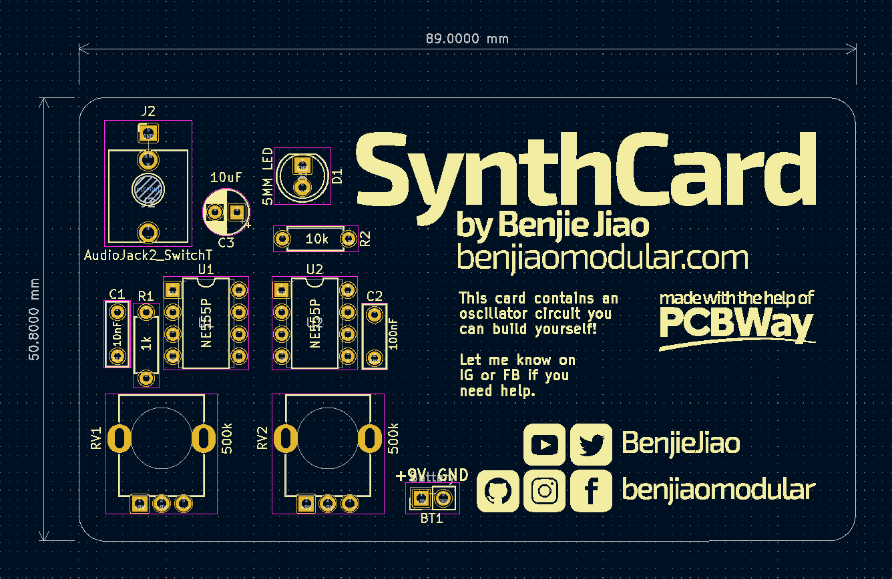

**NOTICE:** This is still a working document. If you'd like to contribute to the development of this document, let Benjie know through Instagram [@benjiaomodular](https://www.instagram.com/benjiaomodular/) or through the project's [Github](https://github.com/SynthCard/synthcard.com/issues).

This document serves as a guide for everyone making SynthCards. The spirit of this document is to allow SynthCards designed by different makers to work with each other.

# Dimensions
SynthCards must be standard business card sized 3.5" x 2.0" or 8.9 x 5.1cm. Cards can optionally have rounded corners. No restrictions on card thickness for now.

# Power
Power input for SynthCards should be between 5-9V but should be regulated down to 5V. 5V power and ground outputs should be available in the form of 2.54-pitch pin connectors to allow chaining of multiple boards together.

# Connectors

Power connections should be done using 2.54-pitch pin headers. An extra pair of power connectors should be available to allow chaining of multiple cards together.

Audio and CV connections should be available through 2.54-pitch pins. SynthCards should be patchable using Dupont connectors. The addition of 3.5mm jacks is optional to allow operability with standard Eurorack systems.
